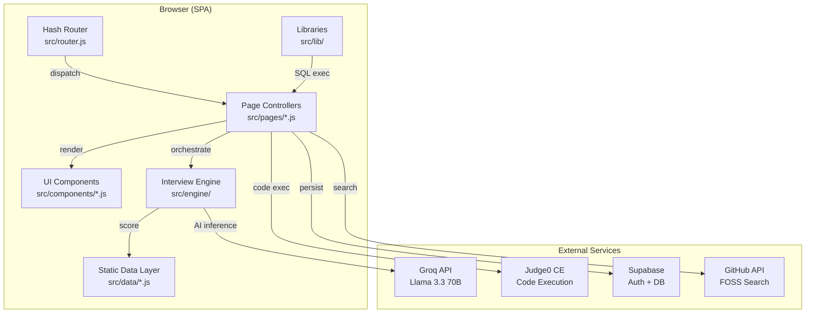

# 🏛️ InterviewOS — Architecture Document

> Technical deep-dive into the system design, component breakdown, data flow, and design decisions.

---

## High-Level Block Diagram



---

## Component Breakdown

### 1. Router (`src/router.js`)

| Attribute         | Detail |
| ----------------- | ------ |
| **Purpose**       | Hash-based SPA routing. Maps URL fragments to page handlers. |
| **Inputs**        | `hashchange` events, programmatic `navigate(path)` calls |
| **Outputs**       | Invokes registered page handler functions with parsed query params |
| **Internal Logic** | Splits hash on `?`, parses query string via `URLSearchParams`, supports wildcard `*` fallback and `before` hooks |
| **Dependencies**  | None (zero-dependency) |
| **Failure Modes** | Unknown routes fall through to `*` handler (renders home page) |

---

### 2. Interview Engine (`src/engine/interviewEngine.js`)

| Attribute         | Detail |
| ----------------- | ------ |
| **Purpose**       | Core finite-state-machine that manages interview lifecycle |
| **Inputs**        | Round type, mode (strict/coaching), question object, difficulty |
| **Outputs**       | State snapshots (`getState()`), final report (`getReport()`) |
| **Internal Logic** | Maintains stage index, conversation log, artifact store, per-dimension scores (1-5 scale), hint counter with mode-aware limits, elapsed/remaining time tracking |
| **Dependencies**  | `rubrics.js` for stage definitions and scoring dimensions |
| **Failure Modes** | Stage advancement past final stage returns `false`; scores clamped to [1, 5] |

#### State Machine Stages by Round

```
DSA:  intro → clarify → approach → code → test → optimize → wrapUp
LLD:  intro → requirements → entities → relationships → patterns → code → wrapUp
HLD:  intro → requirements → estimation → architecture → dataModel → api → tradeoffs → wrapUp
HR:   intro → question → followUp1 → followUp2 → followUp3 → wrapUp
```

---

### 3. Round Handlers (`src/engine/{dsa,lld,hld,hr}Round.js`)

| Attribute         | Detail |
| ----------------- | ------ |
| **Purpose**       | Implement round-specific interview logic and NLP-based scoring |
| **Inputs**        | Candidate text input, current engine state |
| **Outputs**       | Interviewer response string, score mutations on the engine |
| **Internal Logic** | Each stage handler uses **regex pattern matching** to detect keywords in candidate responses (e.g., detecting "sliding window" in approach, "STAR" in behavioral). Scores are adjusted with deltas (+0.2 to +0.5 for good signals, -0.2 to -0.5 for bad signals). Stage transitions are triggered by detecting readiness keywords. |
| **Dependencies**  | `InterviewEngine` instance |
| **Failure Modes** | Unrecognized input returns a generic prompt to continue |

#### DSA Round — Scoring Heuristics

```
┌─────────────┬──────────────────────────────────────────────────┐
│ Signal      │ Regex Pattern                                    │
├─────────────┼──────────────────────────────────────────────────┤
│ Optimal     │ /sliding|window|hash|map|two.?pointer|dp|greedy/ │
│ Brute Force │ /brute|naive|n\^2|nested loop/                   │
│ Complexity  │ /o\(.*\)|time|space|complex/                     │
│ Edge Cases  │ /edge|boundary|empty|null|single|max|min/        │
│ Readiness   │ /ready|proceed|move on|approach|solution/        │
└─────────────┴──────────────────────────────────────────────────┘
```

---

### 4. AI Service Layer (`src/services/aiService.js` + `src/engine/api.js`)

| Attribute         | Detail |
| ----------------- | ------ |
| **Purpose**       | Interface to Groq's OpenAI-compatible API for Llama 3.3 70B inference |
| **Inputs**        | System prompt, user message, optional JSON parsing flag |
| **Outputs**       | Raw text or parsed JSON response |
| **Internal Logic** | Sends `POST` to `https://api.groq.com/openai/v1/chat/completions`. Strips markdown code fences for JSON parsing. Supports `debug`, `explain`, `optimize`, and `review` modes for code analysis. |
| **Dependencies**  | `VITE_GROQ_API_KEY` environment variable |
| **Failure Modes** | Missing API key throws immediately. HTTP errors are caught and re-thrown. Invalid JSON triggers retry prompt. Fallback to engine's built-in NLP responses when API is unavailable. |

#### Agent Profiles (`src/engine/agents.js`)

| Agent ID              | Persona                | Use Case |
| --------------------- | ---------------------- | -------- |
| `jd-parser`           | Notanki Agent          | JD analysis → structured JSON extraction |
| `code-reviewer`       | FAANG Principal Engineer | Code review with PASS/WARN/FAIL scoring |
| `hr-interviewer`      | Senior HR Partner      | Behavioral interview with STAR enforcement |
| `notanki-interviewer` | Notanki Agent          | High-pressure technical interviewer |

---

### 5. MiniSQL Engine (`src/lib/miniSQL.js`)

| Attribute         | Detail |
| ----------------- | ------ |
| **Purpose**       | Zero-dependency in-browser SQL query engine for interactive practice |
| **Inputs**        | SQL query string, pre-loaded table data |
| **Outputs**       | Array of result row objects |
| **Internal Logic** | Tokenizes SQL using sentinel markers (`§FROM§`, `§WHERE§`, etc.). Supports CTEs via recursive `_select()`. JOIN implementation uses brute-force nested loop with key matching. Aggregations computed per group with standard SQL semantics. |
| **Dependencies**  | None (pure JavaScript) |
| **Failure Modes** | Unsupported query types throw descriptive errors. Missing tables throw with table name. Unparseable ON conditions throw with the condition string. |

#### Supported SQL Features

```
Clauses:   SELECT, FROM, WHERE, JOIN, LEFT JOIN, GROUP BY, HAVING, ORDER BY, LIMIT, DISTINCT, WITH (CTE)
Functions: COUNT, SUM, AVG, MIN, MAX, ROUND, IFNULL
Operators: =, !=, <>, >, <, >=, <=, AND, OR, LIKE, NOT LIKE, IN, NOT IN, IS NULL, IS NOT NULL
```

---

### 6. Code Execution (`src/services/codeRunner.js`)

| Attribute         | Detail |
| ----------------- | ------ |
| **Purpose**       | Execute candidate code via Judge0 CE API |
| **Inputs**        | Language, source code, stdin |
| **Outputs**       | `{ success, output, error, time }` |
| **Internal Logic** | Maps language names to Judge0 IDs. Auto-renames Java `class Solution` to `class Main`. Handles status codes: 3 (accepted), 5 (TLE), 6 (compile error), 7-12 (runtime error). |
| **Dependencies**  | `VITE_JUDGE0_HOST`, `VITE_JUDGE0_API_KEY` |
| **Failure Modes** | Missing API key sends request without auth headers (works for self-hosted Judge0). Network failures return error object. |

---

## Data Flow

### Primary Path: Interview Session

```
1. User selects round type, mode, difficulty on Home page
   │
2. Router dispatches to /interview with query params
   │
3. InterviewEngine instantiated with question + rubric
   │
4. RoundHandler.processInput('') → initial interviewer message
   │
5. ┌─────── Interview Loop ────────┐
   │ User types response in Chat   │
   │         ↓                     │
   │ RoundHandler.processInput()   │──→ Regex scoring (local)
   │         ↓                     │
   │ callGrokAPI() (async)         │──→ AI-enhanced response (remote)
   │         ↓                     │
   │ Merge: prefer AI if valid     │
   │         ↓                     │
   │ engine.advanceStage()         │
   │ engine.updateScore()          │
   │         ↓                     │
   │ Display response in Chat      │
   └───────────────────────────────┘
   │
6. engine.complete() → isComplete = true
   │
7. generateReport(engine) → rubric scores, strengths, mistakes, practice plan
   │
8. Router navigates to /report → renders performance dashboard
```

### Secondary Path: JD Analysis

```
1. User pastes JD text (min 100 chars)
   │
2. callGrokAPI(JD_PARSER.systemPrompt, jdText)
   │
3. AI returns structured JSON:
   { domain, signal_mode, company, tech_stack_detected,
     assessment, foss_projects, faang_rubric, study_plan,
     learning_resources }
   │
4. renderResults() populates:
   - Meta cards (domain, company, tech stack)
   - Take-home README with stretch goals
   - FOSS repo cards with GitHub links
   - FAANG rubric evaluation
   - Day-by-day study plan
   - YouTube recommendations
   │
5. User can chat with Notanki Agent about the JD
```

---

## Design Decisions & Tradeoffs

### 1. Vanilla JS over React/Vue (for pages)

**Decision**: Page controllers are written in Vanilla JS with template literals.
**Why**: Minimizes bundle size, eliminates framework overhead, and keeps the app fast. The interview experience benefits from raw DOM performance during real-time chat.
**Tradeoff**: More verbose component creation; no virtual DOM diffing.
**Exception**: Resume builder uses React/JSX (needed for `@react-pdf/renderer`).

### 2. Regex NLP over Full AI for Scoring

**Decision**: Round handlers use regex pattern matching for primary scoring, with AI as an enhancement layer.
**Why**: Ensures the app works offline and without API keys. Scoring is deterministic and debuggable. AI responses are used for richer interviewer dialogue but don't drive scores.
**Tradeoff**: Keyword-based scoring can miss nuanced answers.

### 3. Hash-Based Routing over History API

**Decision**: Uses `#/path` instead of `history.pushState`.
**Why**: Works without server configuration. No 404 issues on static hosting. Simplifies deployment to GitHub Pages, Netlify, etc.
**Tradeoff**: URLs contain `#`, which is less clean.

### 4. Embedded Data over API-Fetched Questions

**Decision**: NeetCode 150 and all questions are embedded as ES modules.
**Why**: Zero network dependency for core functionality. Instant load. Works offline.
**Tradeoff**: Adding new questions requires a code change and rebuild.

### 5. Custom MiniSQL over sql.js/SQLite WASM

**Decision**: Built a custom SQL parser instead of using sql.js (SQLite compiled to WASM).
**Why**: Eliminates a 2MB+ WASM dependency. The engine supports the exact SQL subset needed for interview practice. Loads instantly.
**Tradeoff**: Limited SQL coverage (no subqueries, no UPDATE/INSERT/DELETE, no window functions).

---

## Scalability & Extension Points

### Adding a New Interview Round

1. Create `src/engine/newRound.js` implementing `getInitialMessage()` and `processInput(input)`
2. Add rubric definition to `src/data/rubrics.js` with dimensions and stages
3. Add questions to `src/data/questions.js`
4. Register handler in `ROUND_HANDLERS` map in `src/pages/interview.js`
5. Add route in `src/main.js`

### Adding a New Page

1. Create `src/pages/newPage.js` exporting `renderNewPage(container)`
2. Register route in `src/main.js`: `.on('/new-page', withSidebar(renderNewPage, 'new-page'))`
3. Add navigation item in `src/components/sidebar.js`

### Swapping AI Provider

1. Modify `src/services/aiService.js` to use a different OpenAI-compatible API
2. Update `.env` with the new base URL and API key
3. The agent profiles in `src/engine/agents.js` are provider-agnostic (standard system prompts)

### Adding Persistent Storage

1. Wire `src/services/auth.js` to Supabase authentication
2. Save interview reports to Supabase tables on `engine.complete()`
3. Add a history page to replay past sessions

---

## Open Questions

> These are design decisions that were made conservatively and may need revisiting.

1. **Should scores be AI-driven?** Currently regex-based. Moving to AI scoring would require prompt engineering to produce consistent numeric scores.
2. **Should questions be server-fetched?** Would enable community contributions but adds latency and a backend dependency.
3. **Is the MiniSQL engine sufficient?** It covers most interview SQL questions but lacks subqueries and window functions. Consider sql.js if coverage becomes an issue.
